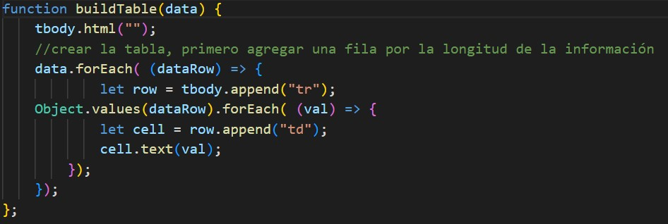
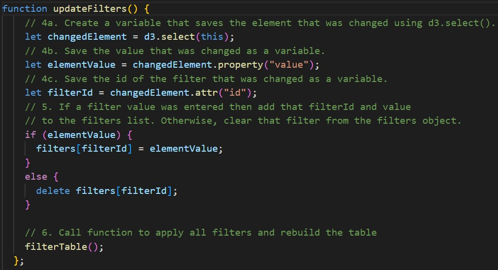
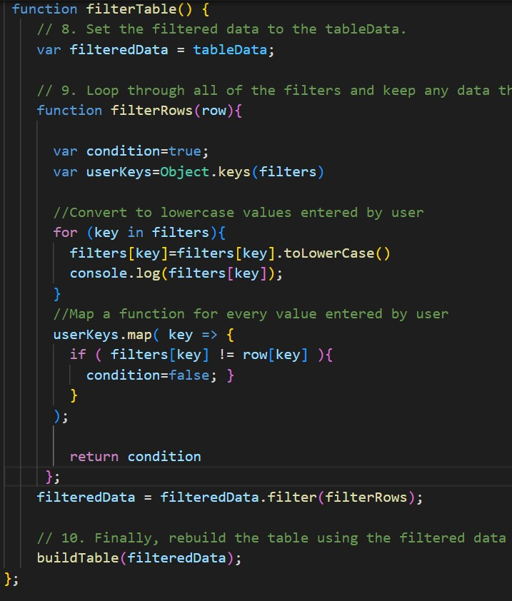
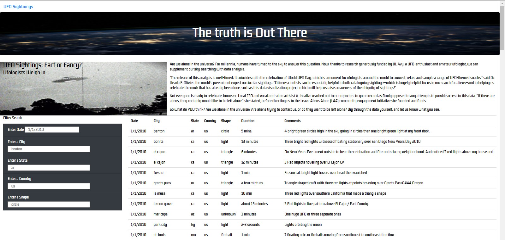
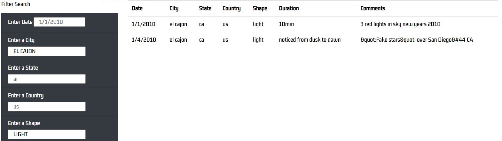

# Customizing a webpage about UFOs with JavaScript, Bootstrap and CSS.

We'll be helping a data journalist who wants to write about UFOs in McMinnville, Oregon. 
We will support her to inspect a file with countries, cities, states, types of sightnings and dates. 
JavaScript will be used to display the data and to manipulate it with filters displaying all this information within an HTML page.

## Overview

A JavaScript file was providede with more than a hundred rows of information regarding sightnings in the US. 
The task was to create an HTML page that displays the whole data and that can receive inputs from the user regarding city, country, state, date and shape of sightning, so they can filter regarding their interests. 
To complete the task three functions were created:

1. The first one to build the table with the complete data.

2. The second one to store the inputs from the users to filter the data

3. The third one to filter the table with the inputs from the user.

## Results:

* The webpage displays correctly and style was added with CSS . 

* The filters aren't case sensitive, so they can display the information if the inputs are in upper or lower case and also filters works for multiple criteria.

